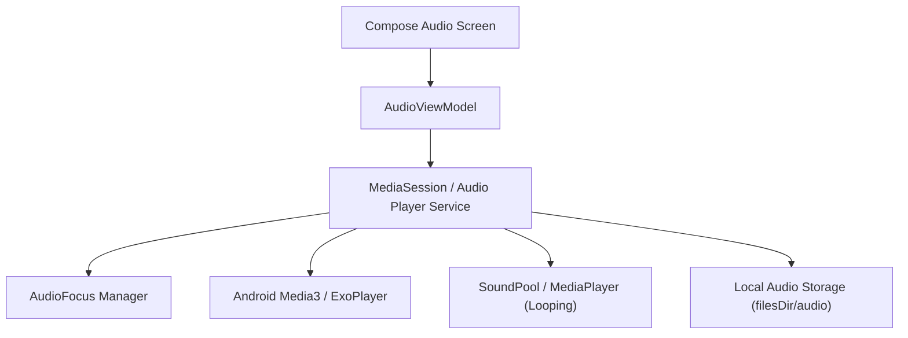

# SoulQuote — Audio System Documentation

## 1. Overview
SoulQuote provides two distinct audio subsystems:
1. **Guided Meditation Player**: Designed for single-track, interactive playback with seek, pause, resume, progress tracking, and lock screen controls.
2. **Ambient Sound Engine**: Designed for looping, background ambient sounds (rain, forest, waves, white noise) with custom volume blending.

---

## 2. Architecture & Components

---

## 3. Audio Download Manager
- **Storage Location**: Saved in `context.filesDir/audio/` (private app internal storage; secure from tampering and excluded from external media scans).
- **Download Workflow**:
  1. Check if `localFileName` already exists in `filesDir/audio/` and verify size.
  2. If missing or incomplete, initiate download via OkHttp streaming or Android `DownloadManager`.
  3. Stream to a temporary file (`.download`).
  4. Upon completion, compute SHA-256 and compare with database `checksum`.
  5. Atomically rename `.download` to the target `.mp3` / `.ogg` filename.
  6. Insert record into `downloaded_audio` user table.
- **Corrupt File Recovery**: If playback fails or checksum check fails, the corrupt file is deleted immediately and the user is offered a clean retry.

---

## 4. Audio Focus & Session Management
- **Audio Focus**: Request `AUDIOFOCUS_GAIN_TRANSIENT_MAY_DUCK` for ambient, and `AUDIOFOCUS_GAIN` for guided meditations.
- **Handling Calls & Notifications**:
  - `AUDIOFOCUS_LOSS`: Pause guided meditation, stop ambient sound, release audio focus.
  - `AUDIOFOCUS_LOSS_TRANSIENT`: Pause meditation temporarily.
  - `AUDIOFOCUS_LOSS_TRANSIENT_CAN_DUCK`: Lower volume to 20% while notification chimes, then restore to 100%.
- **Battery Preservation**: Never leave players initialized when paused or screen off unless explicitly playing in background.
