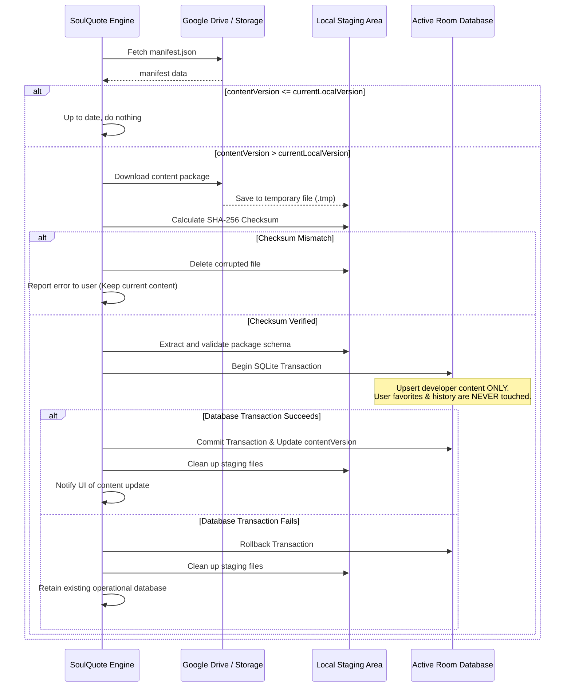

# SoulQuote — Content Update System

## 1. Overview
SoulQuote enables regular updates to quotes, templates, ambient sounds, and meditation catalogs **without requiring APK updates**. Content is distributed as structured packages validated with cryptographic checksums.

---

## 2. Content Manifest Format
The app first fetches a lightweight `manifest.json` from the distribution source:

```json
{
  "contentVersion": 2,
  "minAppVersion": 1,
  "databaseVersion": 1,
  "updatedAt": "2026-09-27T00:00:00Z",
  "packageUrl": "https://storage.googleapis.com/.../soulquote-content-v2.zip",
  "checksum": "e3b0c44298fc1c149afbf4c8996fb92427ae41e4649b934ca495991b7852b855",
  "sizeBytes": 1450200,
  "changelog": "Added 50 Stoic reflections and 3 calming ambient sound presets."
}
```

---

## 3. Safe Update Transaction Workflow



---

## 4. Bandwidth & Storage Optimization
- **Segregated Audio**: Large audio files are NOT packaged in the core database zip. The content package contains only metadata and URLs. Audio is downloaded individually on user demand or pre-cached optionally.
- **Differential/Incremental Upsert**: The update mechanism performs an `INSERT OR REPLACE` on developer content tables, preserving existing local user state.
