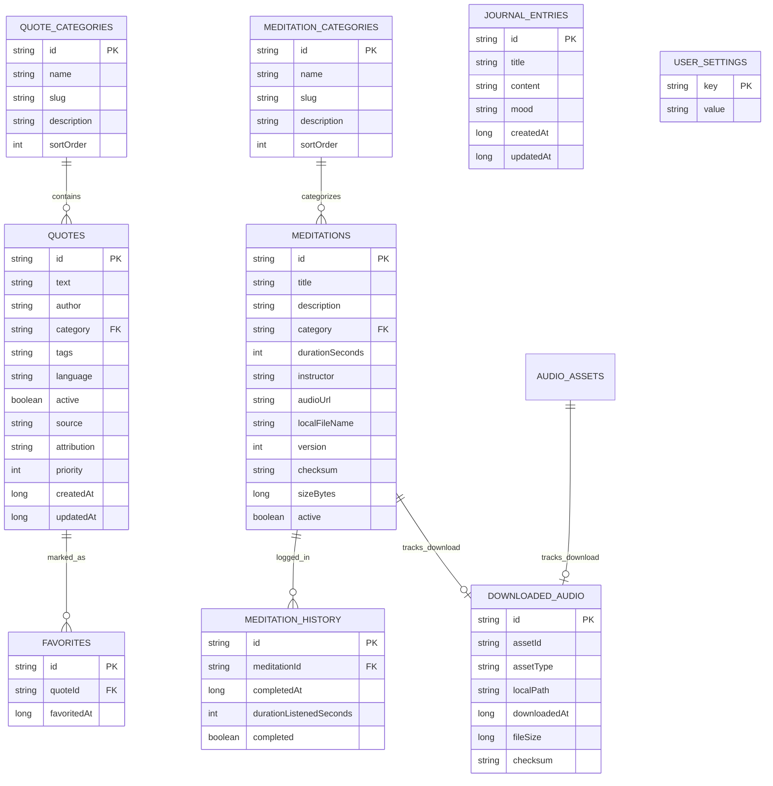

# SoulQuote — Database Documentation

## 1. Database Philosophy & Separation
SoulQuote strictly segregates **Developer Content** from **User Data**.
- **Developer Content**: Immutable content shipped with the app or updated via remote packages (quotes, categories, meditations, ambient audio metadata, templates, backgrounds).
- **User Data**: Purely personal user data that must never be altered or wiped during content updates (favorites, meditation history, journal entries, downloaded audio tracks, user settings).

---

## 2. Table Specifications

### 2.1. Developer Content Entities

#### `quotes`
| Column | Type | Nullable | Description |
|---|---|---|---|
| `id` | TEXT | No (PK) | Unique quote UUID or identifier |
| `text` | TEXT | No | Quote text content |
| `author` | TEXT | No | Author name |
| `category` | TEXT | No | Category ID matching `quote_categories.id` |
| `tags` | TEXT | Yes | Comma-delimited keywords/tags |
| `language` | TEXT | No | ISO language code (e.g. `id`, `en`) |
| `active` | INTEGER | No | `1` if visible, `0` if archived |
| `source` | TEXT | Yes | Source book, lecture, or reference |
| `attribution` | TEXT | Yes | Public domain or licensing info |
| `priority` | INTEGER | No | Display sorting priority |
| `createdAt` | INTEGER | No | Timestamp in milliseconds |
| `updatedAt` | INTEGER | No | Timestamp in milliseconds |

#### `meditations`
| Column | Type | Nullable | Description |
|---|---|---|---|
| `id` | TEXT | No (PK) | Unique meditation UUID |
| `title` | TEXT | No | Title of session |
| `description` | TEXT | Yes | Detailed description/guidance |
| `category` | TEXT | No | Category ID |
| `durationSeconds` | INTEGER | No | Duration in seconds |
| `instructor` | TEXT | Yes | Name of speaker/instructor |
| `audioUrl` | TEXT | No | Remote streaming or download URL |
| `localFileName` | TEXT | No | Relative filename when saved to disk |
| `version` | INTEGER | No | Audio asset version |
| `checksum` | TEXT | No | SHA-256 hash for integrity validation |
| `sizeBytes` | INTEGER | No | File size in bytes |
| `active` | INTEGER | No | Active status |

#### `templates`
| Column | Type | Nullable | Description |
|---|---|---|---|
| `id` | TEXT | No (PK) | Template identifier |
| `name` | TEXT | No | Display name |
| `preview` | TEXT | Yes | Asset/drawable path for preview |
| `background` | TEXT | No | Background definition (hex or asset path) |
| `font` | TEXT | No | Font family identifier |
| `fontSize` | INTEGER | No | Font size in SP |
| `textColor` | TEXT | No | Hex color code |
| `alignment` | TEXT | No | `start`, `center`, `end` |
| `overlay` | TEXT | Yes | Overlay style or color |
| `active` | INTEGER | No | Active status |
| `version` | INTEGER | No | Template version |

---

### 2.2. User Data Entities

#### `favorites`
- `id` (PK, TEXT): UUID
- `quoteId` (TEXT, Indexed): References `quotes.id`
- `favoritedAt` (INTEGER): Timestamp

#### `meditation_history`
- `id` (PK, TEXT): UUID
- `meditationId` (TEXT, Indexed): References `meditations.id`
- `completedAt` (INTEGER): Timestamp
- `durationListenedSeconds` (INTEGER): Seconds listened
- `completed` (INTEGER): `1` if completed, `0` otherwise

#### `downloaded_audio`
- `id` (PK, TEXT): UUID
- `assetId` (TEXT, Indexed): Meditation or Ambient audio ID
- `assetType` (TEXT): `meditation` or `ambient`
- `localPath` (TEXT): Absolute path in internal app files
- `downloadedAt` (INTEGER): Timestamp
- `fileSize` (INTEGER): Size in bytes
- `checksum` (TEXT): Verified SHA-256 hash

---

## 3. Migration and Content Ingestion Strategy
1. **Asset Seeding**: Initial database bundled inside `assets/databases/soulquote_seed.db` or ingested from JSON seed on first launch.
2. **Content Updates**: When a new content package is downloaded, only developer content tables are upserted. User data tables remain untouched.
3. **Foreign Keys**: Soft references or `ON DELETE CASCADE` only between content tables and user relations where explicitly safe.
