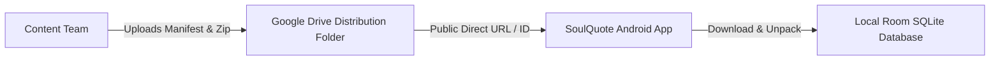

# SoulQuote — Google Drive Content Distribution

## 1. Role of Google Drive
Google Drive functions strictly as **Content Distribution Storage (CDN/Static Storage)**, not as a real-time runtime database.



---

## 2. Directory Layout on Distribution Storage
```text
Google Drive/SoulQuote_Distribution/
├── manifest.json
├── packages/
│   ├── soulquote-content-v1.0.0.zip
│   └── soulquote-content-v1.1.0.zip
├── meditation/
│   ├── meditation_manifest.json
│   └── audio/
│       ├── gratitude_morning_v1.mp3
│       └── deep_sleep_v1.mp3
└── ambient/
    ├── ambient_manifest.json
    └── audio/
        ├── rain_soft_v1.ogg
        └── ocean_waves_v1.ogg
```

---

## 3. Direct Access & Link Resolution
- Files are hosted with view permissions set to "Anyone with the link".
- Download endpoint format:
  `https://drive.google.com/uc?export=download&id={FILE_ID}`
- **Fallback Endpoints**: In production, secondary mirror endpoints (e.g., GitHub Releases or Cloudflare Workers) can be configured in `manifest.json` as mirror URLs to guard against Google Drive download quota limits.

---

## 4. Resilience Guarantees
- **No Runtime Dependency**: The app NEVER queries Google Drive during normal quote reading, meditation playing, or card editing.
- **Graceful Failure**: If Google Drive is unreachable or returns HTTP 429/403, the app simply reports "Content up to date" or "Update check unavailable" and continues normal offline operations.
