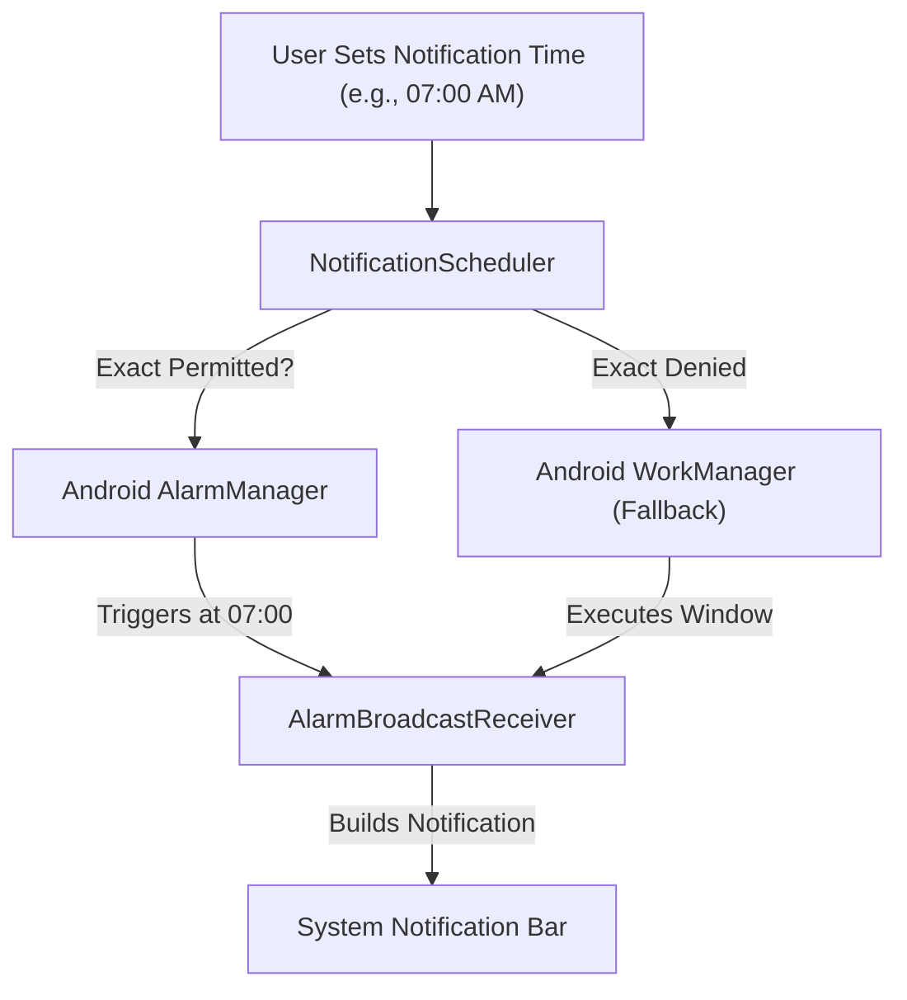

# SoulQuote — Notification System Documentation

## 1. Overview
SoulQuote provides two key notification types:
1. **Daily Quote**: Delivers an inspirational quote at the user's preferred morning or evening time.
2. **Meditation Reminder**: Alerts the user on designated days to practice mindfulness.

---

## 2. Notification Channels (Android 8.0 / API 26+)

| Channel ID | Name | Importance | Sound | Vibration |
|---|---|---|---|---|
| `channel_daily_quote_v1` | Daily Inspiration | `IMPORTANCE_DEFAULT` | `mindful_bell.ogg` (raw) | Enabled |
| `channel_meditation_v1` | Meditation Reminder | `IMPORTANCE_HIGH` | `zen_singing_bowl.ogg` (raw) | Enabled |

> [!IMPORTANT]
> In Android, once a `NotificationChannel` is created, user-facing sound and importance cannot be programmatically altered. If the default custom sound changes in a future release, a versioned channel ID (e.g., `_v2`) is deployed.

---

## 3. Scheduling Architecture

---

## 4. Android Permission & Battery Handling
- **Android 13+ (API 33)**: Prompts user for `android.permission.POST_NOTIFICATIONS` runtime permission with contextual explanation.
- **Android 14+ (API 34)**: Checks `alarmManager.canScheduleExactAlarms()`. If granted, uses `setExactAndAllowWhileIdle()`. If not granted, falls back to inexact `setAndAllowWhileIdle()` to guarantee battery efficiency without crashes.
- **Boot Restoration**: `BootReceiver` listens to `ACTION_BOOT_COMPLETED` and queries `notification_settings` to restore pending alarms.
