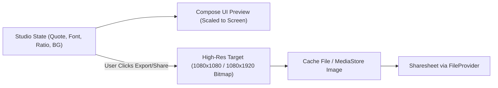

# SoulQuote — Quote Studio Documentation

## 1. Overview
Quote Studio is a core creative feature allowing users to turn quotes into visually stunning cards formatted for Instagram, WhatsApp Status, and other social channels.

---

## 2. Capabilities & Configuration

| Feature | Details |
|---|---|
| **Aspect Ratios** | `1:1` (Square / Feed), `9:16` (Story / Status), `4:5` (Portrait) |
| **Backgrounds** | Solid color, Dual-color linear gradient, Curated bundled assets, User Gallery |
| **Typography** | Serif, Sans-serif, Cursive/Handwritten; Dynamic font scaling; Alignment (Left/Center/Right) |
| **Text Effects** | Drop shadow (blur radius, offset, color), Text color picker |
| **Overlays** | Dimmer overlay (0%–100% opacity), Soft vignette effect |
| **Watermark** | Optional unobtrusive "SoulQuote" branding toggle |
| **Templates** | Bundled presets updatable via remote content packages |

---

## 3. High-Resolution Rendering Pipeline

---

## 4. Privacy & Modern Android Sharing
- **No Legacy Storage Permission Needed**: Uses `MediaStore` with scoped storage on Android 10+ (API 29+) and modern Android Photo Picker (`PickVisualMedia`) on Android 13+.
- **Secure Sharing via `FileProvider`**:
  - Rendered image saved in `cacheDir/shared_quotes/quote_{timestamp}.png`.
  - Content URI generated via `FileProvider.getUriForFile()`.
  - Intent flags: `FLAG_GRANT_READ_URI_PERMISSION`.
  - Cleaned up periodically to avoid consuming device storage.
