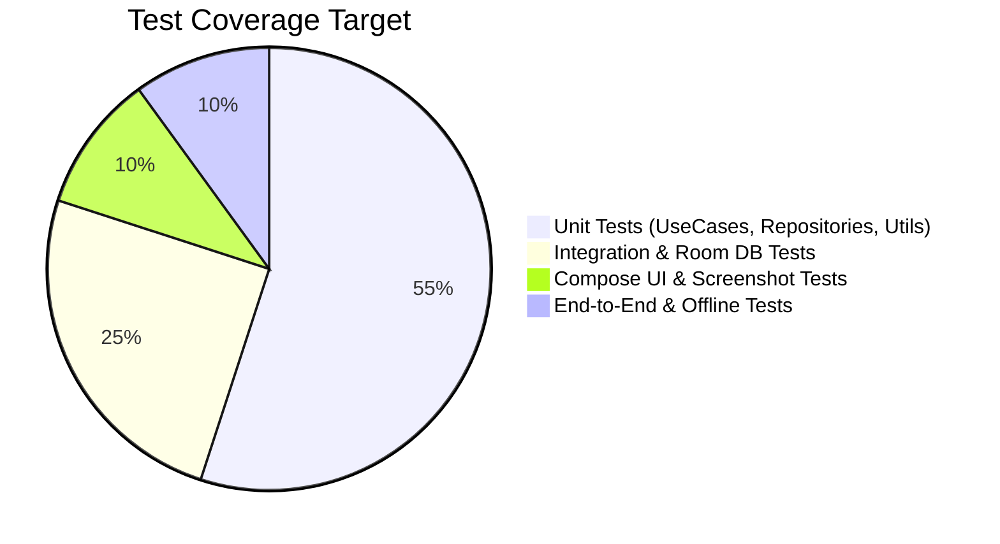

# SoulQuote — Testing Strategy & Verification

## 1. Testing Strategy
SoulQuote implements comprehensive testing across all layers to ensure reliability, offline-first behavior, and data integrity.

---

## 2. Test Suites & Focus Areas

### 2.1. Unit Tests (`app/src/test`)
- **Daily Quote Selection**: Verify date hashing determinism, timezone boundary handling, and random fallback.
- **Manifest Parser & Validator**: Verify correct parsing of semantic versions and SHA-256 hash checks.
- **Data Segregation**: Verify user preferences and favorites are unaffected during repository operations.

### 2.2. Room Database Tests (`app/src/androidTest`)
- **DAO Operations**: Insert, query, soft-delete, and reactive `Flow` emissions.
- **Migration Tests**: Verify schema transitions (e.g., v1 -> v2) using Room's `MigrationTestHelper`.

### 2.3. Audio & Network Resilience Tests
- **Simulated Network Interruption**: Abrupt connection drop during content download; verify temporary files are safely removed.
- **Checksum Tampering Test**: Verify corrupted download packages trigger rejection and keep existing content intact.

### 2.4. Offline Verification Checklist
- [ ] Turn off Wi-Fi and Cellular Data.
- [ ] Launch application: Quotes display seamlessly from local Room cache.
- [ ] Play pre-downloaded guided meditation: Audio starts instantly.
- [ ] Play ambient background audio: Loops smoothly without stalling.
- [ ] Open Quote Studio: Edit card, change typography, render and share.
- [ ] Toggle favorites and change settings: Changes persist across app restarts.
